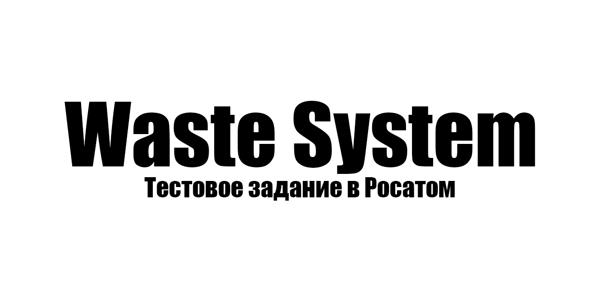
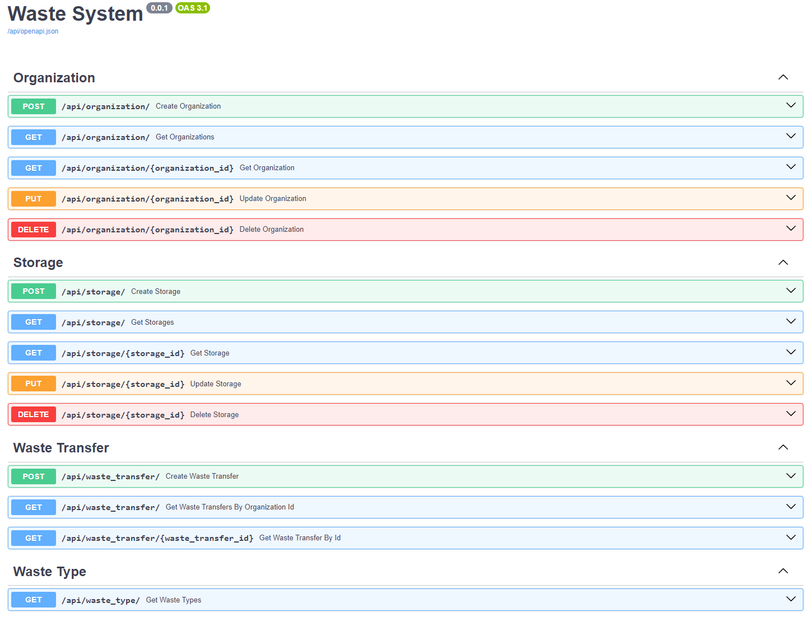
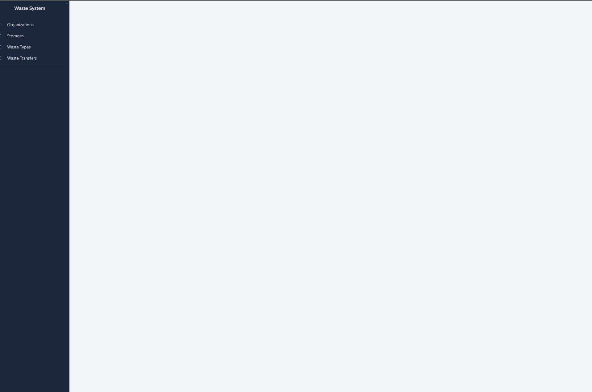

## Запуск
Приложение разворачивается в докере
```shell
git clone https://github.com/Noloquideus/Waste-System.git
```
```shell
docker-compose up --build
```
## Использование
Табличка Waste Type заполняется данным при развертывании приложения
Для работы потребуется:
- Создать организацию
- Создать хранилище

## Приложение
### Swagger
```shell
http://localhost:7777/api/docs
```
или
```shell
http://localhost:1111/api/docs
```


### Админка
```shell
http://localhost:7777/api/admin/
```


### Nginx
- Работает на 1111 порту и проксирует на 7777
- Служит фаерволом и блокирует все запросы, кроме GET-запросов